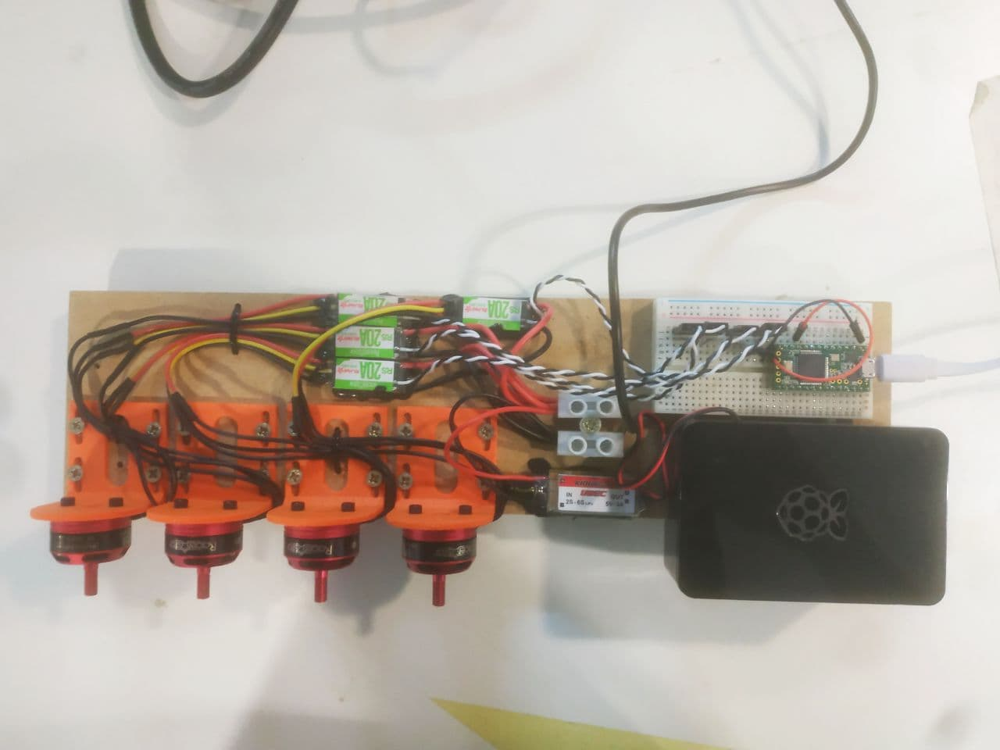

# Motor Synth: A MIDI synthesizer using motors
This repo contains the firmware and instructions needed to build a synthesizer that uses brushless motors to perform the sound and is controlled with MIDI commands.

## Hardware
Currently, we use a Teensy 3.2 MCU for managing MIDI input, motor control and synth logic.

## Status
Work in progress. Currently we have a monophonic version that can be tuned using MIDI control knobs.

## Images
This is the synth without the power transformers. We can see 4 motors on the bottom-left and their drivers on the top of them. On the right you can see the Teensy and Raspberry.

