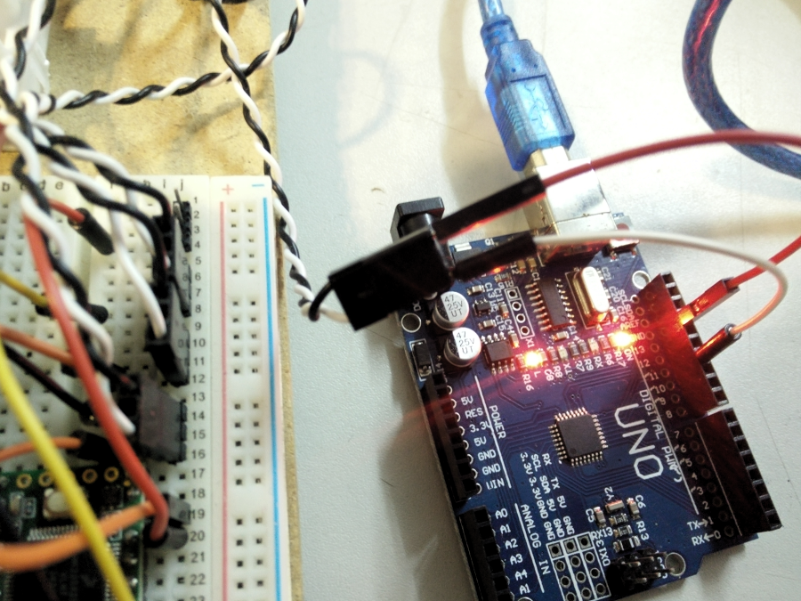

# How to configure the ESCs

Follow [this article](https://reefwing.medium.com/configuring-an-esc-with-blheli-firmware-using-an-arduino-uno-9b8e5dafc1c5) instructions on using an Arduino to reconfigure the ESCs. Remember to use pin 11 in the Arduino UNO.

Arduino UNO pin connections:

The BLHeliSuite can be found (only for Windows...) [here](https://www.mediafire.com/folder/dx6kfaasyo24l/BLHeliSuite)

Current ESC configuration:

Original ESC configuration:
